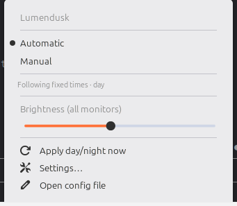

# Lumendusk

> Automatic dark/light theme, **night light** (warm color temperature), **and monitor brightness** for your desktop — driven by the time of day.

Lumendusk is a lightweight tool that adjusts your desktop automatically, with no interaction needed:

1. Switches the system theme between **light** (day) and **dark** (night).
2. Turns **night light / warm screen tint** on at night and off during the day.
3. Sets **monitor brightness** to a day level and a dimmer night level.

The main way you use it is as a **panel applet** you add to your panel — a small
icon with a dropdown menu. A background engine does the work behind it.



In **Automatic** the menu just reports what it's doing. Switch to **Manual**
and it grows Light / Dark buttons and a night light toggle — see
[Automatic and Manual](#automatic-and-manual).

Built for **Linux Mint (Cinnamon)** first, then Windows (system-tray icon) and
macOS (menu-bar extra).

**Core principles:** simple · automatic · offline-first · low resource usage · cross-platform.

---

## Status

🚧 Early development — Phase 1 (Linux Mint). Working today:

- Two modes, **Automatic** and **Manual**, switchable from the panel menu.
  Automatic follows the schedule; Manual hands the desktop back to you.
- Sun (offline, via `astral`) or fixed-time day/night detection.
- **Whole-desktop dark/light switching** — driven by Mint's own style catalog,
  it moves the shell, panel, window borders, GTK/GTK4 apps, Flatpak apps (XApp
  portal), icons and accent together (not just the GTK theme), and night light
  on/off.
- **A choice of appearance for each half of the day** — want dark at noon too?
  See [Dark all day](#dark-all-day).
- A brightness read/set/list tool across sysfs/brightnessctl, ddcutil, and
  xrandr backends (Step B1).
- **Brightness on day/night transitions** (Step B3) — day and night levels
  applied alongside the theme. Off by default: turn on "Change brightness with
  the time of day" in the settings panel.
- A Cinnamon **panel applet**: the mode switch, Light/Dark and a night light
  toggle in Manual, and a brightness slider.
- A **settings panel** (right-click → Configure) for mode, location, times,
  night-light warmth and brightness presets — including one-click location
  detection from your system timezone.
- A background daemon that **autostarts on login**.

Both transitions have been seen running unattended on a real desktop — a
`night → day` at 08:00 and a `day → night` at 18:00 on the same day, with
brightness enabled — and resume-from-suspend re-evaluates as intended.

**Sun mode** is now what this machine runs, after a year of test dates checked
against `astral`'s own sunrise and sunset from the equator to the Arctic — but
those were transitions on the clock, not on a screen, and a day lived in sun
mode is still owed.

Still to do before this loses the 🚧: that day, a suspend that spans a
transition (the resumes so far have all landed inside a phase), and then the
optional smooth fade around transitions.

## How it works

- Runs quietly in the background, started with the applet / on login.
- Decides day vs. night from either **sunrise/sunset** (computed offline from
  your latitude/longitude via [`astral`](https://pypi.org/project/astral/)) or
  **fixed times** you set.
- On a day↔night transition it applies the matching theme, toggles night light,
  and (if enabled) sets the brightness preset.
- Applies only *on transitions*, so a manual change you make by hand sticks until
  the next transition. Wakes about once a minute; idle in between.
- A setting you *change* is the exception: it takes effect straight away, and
  only what changed moves. Editing the day brightness after dark leaves tonight
  alone.

### Automatic and Manual

One switch decides who is driving, and it's the first thing in the panel menu.

**Automatic** is the normal state: Lumendusk follows your schedule, and the menu
just tells you what it's doing ("Following sunrise and sunset · night"). It
deliberately offers no dark/light buttons here — a choice that silently expires
at the next sunrise is worse than no choice at all.

**Manual** hands the desktop back to you. The menu grows **Light** / **Dark**
and a **Night light** switch, and nothing changes on its own until you switch
back — not on a transition, not after a suspend, not on your next login.
Switching *into* Manual drops the night light once, so colors are true for a
film; after that the toggle is yours.

Both live in the settings panel too, so the menu and Configure never disagree.

### Dark all day

Day means light and night means dark only because that's the default. Each
phase has its own setting, under **Configure → Screen → Appearance**:

| Daytime | Night-time | What you get |
|---------|-----------|--------------|
| Light | Dark | The default — light by day, dark after dark. |
| **Dark** | **Dark** | **Dark around the clock, and the screen still warms and dims at night.** |
| Light | Light | The theme never changes; night light and brightness still do. |

That second row is the reason this exists: preferring a dark desktop shouldn't
cost you the night light and the dimming, which is what happens if you reach
for Manual instead. Manual freezes *everything*; this only pins the theme.

From a terminal:

```bash
lumendusk config set theme_day dark      # dark at noon as well
lumendusk appearance auto                # apply what the schedule wants now
```

The change takes effect immediately — the transition-only rule protects the
tweaks you make by hand, not the settings you just asked for. The same goes for
the night light warmth and the brightness presets: change one and you see it,
as long as it's the phase you're actually in.

## Install (Linux Mint / Cinnamon)

Needs **Python 3.9+** and `python3-venv` (`sudo apt install python3-venv`) —
Mint 21 and 22 both ship a new enough Python.

```bash
git clone https://github.com/Kasun24/lumendusk.git
cd lumendusk
./install.sh
```

`install.sh` builds a self-contained venv under
`~/.local/share/lumendusk/venv` (nothing is installed into your system Python),
copies the applet into place, and starts the background daemon.

Then right-click your panel → **Add applets** → **Lumendusk** → **+**.

Optional system tools, each unlocking one feature:

| Tool | What it adds |
|------|--------------|
| `ddcutil` | Brightness on external monitors over DDC/CI (needs the `i2c-dev` module and your user in the `i2c` group) |
| `brightnessctl` | Laptop-panel brightness without root |
| `gammastep` or `xsct` | Night light where Cinnamon's own keys are missing |

### Uninstall

```bash
./uninstall.sh
```

Removes the venv, the applet, and the autostart entry. Your config is kept
unless you pass `--purge`.

## Setting it up

**Right-click the panel icon → Configure.** Everything lives there: Automatic
vs. Manual, whether to follow the sun or fixed times, your location, how yellow
the night light goes, and the brightness presets.

Day/night comes from either your **location** (sunrise/sunset, computed
offline) or **fixed times**. Fixed times (dark 19:00, light 07:00) are the
default, because there is no way to guess a location offline.

Switching to **Sunrise and sunset** needs coordinates. Rather than making you
look them up, **Detect from my timezone** reads the location your system
timezone already implies — `Asia/Colombo` → 6.93, 79.85. That comes from
`/usr/share/zoneinfo`, so it works with no network and no extra dependency.
It's accurate to the timezone's main city, which puts sunset within a minute or
two for most people; the fields stay editable if you want it exact.

The same thing from a terminal:

```bash
lumendusk location                   # what's set, and what would be detected
lumendusk location --detect          # take it from the system timezone
lumendusk location 51.5074 -0.1278   # or set it yourself → switches to sun mode
lumendusk status                     # mode, current phase, and where config/log live
```

Settings are stored in `~/.config/lumendusk/config.toml`; the settings panel is
a view onto that file and writes changes straight back to it, so the CLI and the
panel can't disagree. Editing the file by hand works too (the applet's **Open
config file** item opens it) — just note that Lumendusk rewrites the file when
anything changes, so comments you add won't survive.

## Command line (for testing / headless)

```bash
lumendusk --once                 # apply the correct day/night state now, then exit
lumendusk                        # run the background daemon
lumendusk status                 # control / mode / phase, plus config + log paths
lumendusk auto                   # follow the schedule, and apply it right now
lumendusk manual                 # leave the desktop to you (night light off)
lumendusk toggle                 # flip between the two
lumendusk nightlight on|off|toggle|status   # the warm tint, right now
lumendusk location               # show the current + auto-detected location
lumendusk location --detect      # set it from the system timezone
lumendusk location LAT LON       # set your location and switch to sun mode
lumendusk config show            # every setting as key=value
lumendusk config set KEY VALUE   # change one setting (validated)
lumendusk brightness list        # show monitors + which backend each uses
lumendusk brightness get         # current brightness
lumendusk brightness set 60      # set brightness to 60%
lumendusk brightness day|night   # apply the day/night brightness preset
lumendusk appearance toggle      # flip whole-desktop dark <-> light (or dark|light|status)
lumendusk appearance auto        # apply the appearance configured for the current phase

# From a source checkout without installing:
PYTHONPATH=src python3 -m lumendusk --once
```

`pause` and `resume` still work as aliases for `manual` and `auto`. If you're
upgrading, a config with the old `enabled = false` or `paused = true` becomes
`control = "manual"` the first time it's read — an upgrade shouldn't start
changing a desktop that was deliberately left alone.

## Troubleshooting

The daemon runs detached, so it writes to a log file rather than a terminal:

```bash
tail -f ~/.local/state/lumendusk/lumendusk.log
```

That's the first place to look if a theme, night light, or brightness change
didn't happen — a missing backend or an unreadable config is reported there.
Lumendusk keeps running on the last good settings rather than exiting.

Monitor detection is cached in `~/.cache/lumendusk/monitors.json`, because
`ddcutil detect` costs about half a second and every brightness change pays
it. The cache is keyed on which displays the kernel reports as connected, so
plugging one in invalidates it at once. `lumendusk brightness list` always
probes for real — use it if a monitor seems to be missing.

A monitor that stops answering over DDC/CI is skipped for five minutes rather
than waited on at every change — ddcutil retries and then times out, and one
wedged display otherwise slows down every transition and every slider move.
The log says so when it happens, and again when the monitor comes back.
`~/.cache/lumendusk/unreachable.json` holds the record; plugging a display in
clears it, as does naming the monitor yourself (`lumendusk brightness set 60
ddc2`) or running `lumendusk brightness list`, which always probes for real.

If a monitor keeps dropping out, power-cycle it at the wall — DDC/CI lives in
the monitor's own controller and it can wedge while the screen carries on
showing a picture. `ddcutil detect` reading the model but reporting
`VCP version: Detection failed` is exactly that: the bus is fine, the
controller isn't listening.

Alongside it, `~/.cache/lumendusk/ddc.lock` keeps two ddcutil calls from
running at once. DDC/CI is a shared bus, and overlapping calls fail with
`Display not found` or `maximum retries exceeded` rather than queueing — so
the daemon applying a preset while the panel menu reads the same monitors
would otherwise lose one of them. Both files are safe to delete at any time.

## Development

```bash
pip install -e '.[sun,dev]'
pytest
ruff check .                             # rules are pinned in pyproject.toml
shellcheck install.sh uninstall.sh packaging/*.sh
bandit -q -r src -ll                     # medium and up; see below
node tests/applet_engine_resolution.js   # the applet's engine lookup
```

CI runs all five.

### Where it puts things

Everything follows the [XDG Base Directory
specification](https://specifications.freedesktop.org/basedir-spec/latest/),
environment variables included — the scripts and the applet read them too, not
just the engine, so a machine that relocates `XDG_DATA_HOME` doesn't end up with
the applet installed where Cinnamon won't look for it.

| What | Where | Notes |
|------|-------|-------|
| Settings | `$XDG_CONFIG_HOME/lumendusk/config.toml` | Written atomically (temp file in the same directory, `fsync`, `rename`), mode 0600 |
| Log | `$XDG_STATE_HOME/lumendusk/lumendusk.log` | Rotates at 256 KB, one backup |
| Cache | `$XDG_CACHE_HOME/lumendusk/` | Monitor list, the ddcutil lock, the daemon lock, which monitors aren't answering. Disposable — `uninstall.sh` removes it without needing `--purge` |
| Autostart | `$XDG_CONFIG_HOME/autostart/lumendusk.desktop` | Passes `desktop-file-validate` |

A note on the `bandit` invocation: `-ll` reports medium and above. This program
drives `gsettings`, `ddcutil` and `xrandr`, so every one of those calls is a
"low" by construction (B404/B603/B607 — subprocess is used at all, and the
binary is found on `PATH`). Nothing runs through a shell: every call is an argv
list with a timeout, there is no `shell=True`, `eval` or `os.system` anywhere,
and the applet quotes each argument with `GLib.shell_quote` for the one call
that goes through `spawnCommandLine`.

The daemon needs no privileges. Writing the internal panel's brightness through
raw sysfs is the only thing that can want more, and the documented answer there
is the `video` group or `brightnessctl` — never root.

### Translations

Every string the applet shows is translatable, and the template lives at
`applet/lumendusk@kasun/po/lumendusk@kasun.pot`. Regenerate it after changing
any user-visible text:

```bash
cd applet/lumendusk@kasun
cinnamon-xlet-makepot -p -o po/lumendusk@kasun.pot .   # needs python3-polib
```

Note `-j` means *skip* JavaScript, not include it. To try a translation
locally, drop a `<lang>.po` beside the template and run the same tool with
`-i`, which compiles and installs it into your locale store.

Status lines are deliberately whole phrases (`Following fixed times · day`)
rather than assembled from pieces — word order and separators move between
languages, so a sentence built by concatenation cannot be translated properly.

### Building the applet bundle

Cinnamon Spices installs an applet by extracting a zip and running nothing —
no venv, no pip, no network. So the shipped applet carries the engine and its
pure-Python dependencies inside it:

```bash
./packaging/build-applet.sh     # → dist/lumendusk@kasun.zip
```

The engine is copied from `src/` on every build rather than kept as a second
copy in git, and `astral` is trimmed to the modules the engine actually
imports (computed from the source, so it can't go stale). The script then runs
the result in an empty environment to prove it works without anything
installed.

The applet prefers a real install over the bundled copy, so a dev checkout or
`pip install` still wins and your edits take effect. The bundle is the floor,
not the ceiling.

### Building the Spices submission tree

The [Cinnamon Spices applets
repository](https://github.com/linuxmint/cinnamon-spices-applets) wants the
applet in two layers — an outer directory for the website, and an inner one
holding exactly what gets zipped onto a user's machine:

```
lumendusk@kasun/
  info.json  screenshot.png  README.md      ← the applet's page
  files/lumendusk@kasun/                    ← this, and only this, is the zip
```

```bash
./packaging/build-spices.sh     # → dist/spices/lumendusk@kasun/
```

It builds the bundle, arranges it that way, and then checks the result against
the rules upstream's `validate-spice` enforces — the outer files must be
present, `files/` must hold nothing but the UUID directory, `metadata.json`
must not carry an `icon`, `dangerous` or `last-edited` field or any non-ASCII
text, the icon must be square, and translations must be `.po`/`.pot` sources
under `po/` with no compiled `.mo`. Running those checks here rather than at
submission time means a forbidden field costs a rebuild instead of a
reviewer's round trip. To submit, copy the tree into a clone of that
repository, run `./validate-spice lumendusk@kasun` there, and open a pull
request for the one applet.

The applet's own page text is `packaging/spices/README.md` — shorter than this
one and aimed at someone deciding whether to install it, so edit that when the
user-facing description changes.

## Roadmap

| Phase | Focus |
|-------|-------|
| 1 | Linux Mint: day/night detection + theme + night light + brightness tool, as a panel applet |
| 2 | Test & polish (full cycle incl. suspend, brightness automation, low CPU/mem) |
| 3 | Cross-platform (Windows system tray + registry, macOS menu bar) |
| 4 | Publish (Cinnamon Spices, Flathub/Snap, Microsoft Store) |

## License

[MIT](LICENSE)
